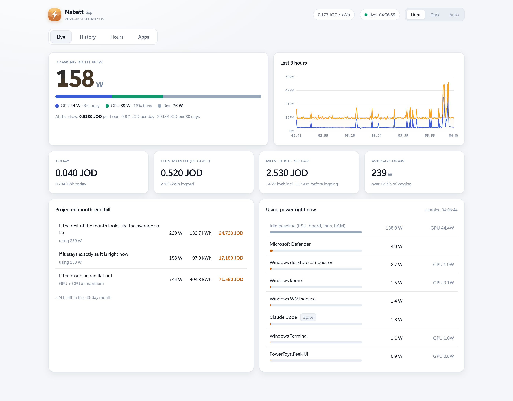
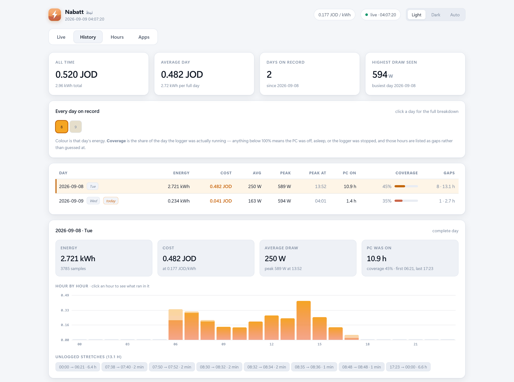
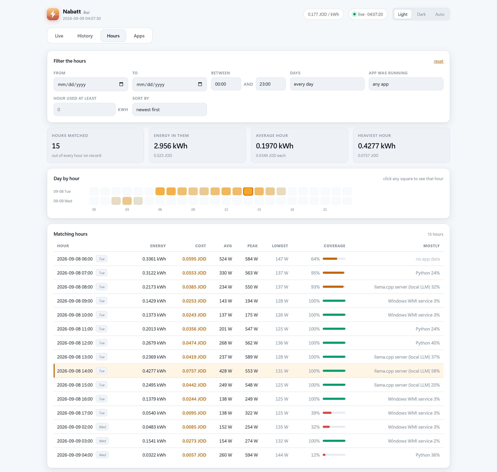
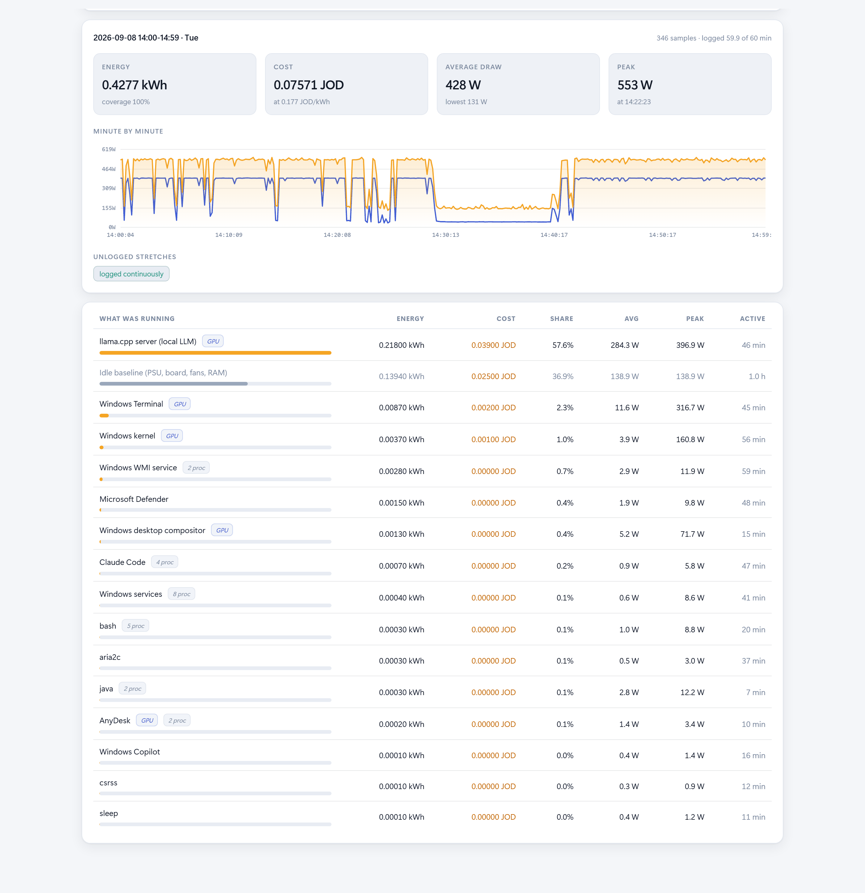
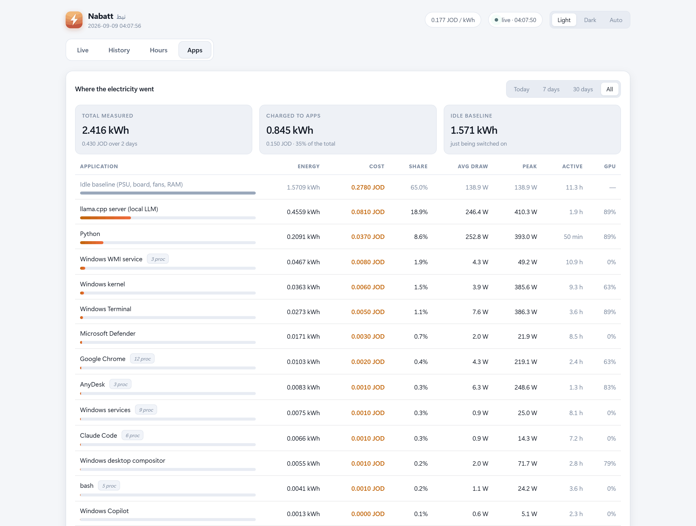

<p align="center">
  
</p>

# Nabatt · نبط

**Nabatt** — from *Nabataean*, the people who cut Petra out of the rock, with
*watt* sitting inside the name.

Measures what this PC actually draws from the wall, what that costs at your
tariff, and which applications are responsible — logged continuously, kept
forever, shown in a desktop app that starts with Windows and lives next to
your clock.

Set `tariff_jd_per_kwh` in `config.json` to the rate on your own
electricity bill, and every cost figure follows from there.

<p align="center">
  
</p>

---

## Install

```powershell
powershell -ExecutionPolicy Bypass -File .\install.ps1
```

No admin rights. It installs to:

| | |
|---|---|
| **Program** | `%LOCALAPPDATA%\Programs\Nabatt` |
| **Data** | `%LOCALAPPDATA%\Nabatt` — `config.json` and `logs\` |

Data sits outside the program folder on purpose, so upgrading, reinstalling or
uninstalling never puts your history at risk. The installer brings across any
`logs\` and `config.json` it finds next to itself, and an existing config in the
data folder always wins — a reinstall will not overwrite a tariff you edited.

Installing registers it with Windows:

- **Nabatt** in the Start Menu and on the Desktop, with the app icon
- an entry in **Settings → Apps → Installed apps**
- **starts at sign-in**, listed in **Task Manager → Startup** so you can switch
  it off there like any other program
- a **tray icon** next to the clock

Re-running it is safe — it upgrades in place. To remove it: **Settings → Apps →
Nabatt → Uninstall**, or run `uninstall.ps1`. Either way your logs and settings
are kept; add `-RemoveData` to delete those too.

Want it self-contained on a USB stick instead? Put an empty file called
`portable.txt` next to the scripts, and config and logs stay in the app folder.

## Using it

| I want to… | Do this |
|---|---|
| Open it | **Nabatt** in the Start Menu / Desktop, or click the tray bolt |
| Pin it to the taskbar | Open it once → right-click its taskbar button → Pin |
| See it from my phone | `http://<this-pc-ip>:8099` on the same Wi-Fi |
| Switch light/dark | The **Light / Dark / Auto** control, top right |
| Open my logs | tray icon → **Open log folder** |
| Stop it for now | `stop-power-tracking.ps1` |
| Start it again | `start-power-tracking.ps1` |
| Remove it completely | Settings → Apps → Nabatt → Uninstall |

The tray bolt is colour-coded by load (green → amber → red); hover it for exact
watts and today's cost, click it to open the window. If a logger ever stops,
the tray restarts it within a minute.

---

## The four tabs

### Live

Current draw split GPU / CPU / rest, a 3-hour curve, today's and this month's
cost, a projected month-end bill under three assumptions, and what is drawing
power *right now*. That is the screenshot at the top of this page.

### History

Every calendar day since logging began, with the day you pick opened
underneath: its energy, cost, hour-by-hour profile, and — stated plainly — the
stretches nobody logged.

<p align="center">
  
</p>

Click any hour bar to jump straight into that hour.

### Hours

Every hour ever recorded, searchable. The filters combine:

| Filter | Use it for |
|---|---|
| **From / To** | a date range |
| **Between** | a time of day, e.g. only 09:00–17:00 |
| **Days** | weekdays only, weekends only, or both |
| **App was running** | only hours where a given app actually drew power |
| **Used at least** | a minimum in kWh — of that app if one is picked, otherwise of the whole hour |
| **Sort by** | newest, most energy, highest peak, highest average |

Under the filters, a **day-by-hour grid** shades every hour by its energy, so
heavy stretches are obvious at a glance.

<p align="center">
  
</p>

Click any square — or any row in the table — and the hour opens in full:
energy, cost, average, peak and the minute it peaked; a **minute-by-minute**
wall and GPU curve; any unlogged stretches inside the hour, to the second; and
**every app that ran in that hour**, with its energy, cost and share.

<p align="center">
  
</p>

Picking an app in the filter also changes the *Mostly* column to show that
app's share of each hour instead of the hour's top app — so "which hours was
llama.cpp actually working, and what did each cost me" is one selection away.
Apps that merely existed without drawing measurable power (under 0.5 Wh in the
hour) are left out, so the list is not padded with noise.

### Apps

Where the electricity went over today / 7 days / 30 days / all time.

<p align="center">
  
</p>

*(the top rows only — the full list runs to every process that drew measurable
power in the range)*

---

## What runs in the background

Four hidden processes, started at sign-in by the `Nabatt` Run entry →
`Nabatt-boot.vbs` → `start-power-tracking.ps1`:

| Process | Job | Writes |
|---|---|---|
| `power-logger.ps1` | whole-machine watts, every 10 s | `logs/power-YYYY-MM.csv` |
| `app-logger.ps1` | per-application share, every 30 s | `logs/apps-YYYY-MM-DD.csv` |
| `dashboard.py` | the web service on port 8099 | — |
| `tray.py` | tray icon + watchdog | — |

`start-power-tracking.ps1` is safe to run twice — it never starts a second copy
of anything.

---

## How the numbers are produced

**GPU watts are measured**, straight from the card's own sensor via
`nvidia-smi --query-gpu=power.draw`. A real reading, not a model.

**CPU watts are modelled** from real CPU utilisation, on a curve between
`cpu_idle_w` and `cpu_max_w`. Add `rest_of_system_w` for board, drives, fans and
RAM, divide by `psu_efficiency`, and that is the wall figure.

**Per-application attribution** uses two Windows counters, both real:

- `\GPU Engine(pid_*)\Utilization Percentage` — per-process GPU busy time
- `Win32_PerfFormattedData_PerfProc_Process` — per-process CPU time

GPU watts *above the card's idle floor* and CPU watts *above idle* are divided
between processes in proportion to those two numbers, then rolled up by
application name.

Everything left over — PSU loss, board, fans, RAM, the GPU's idle floor — is
logged as **`__baseline__`** and shown as *Idle baseline*. It is never charged
to an application, so an app's share is what it actually added, not a number
padded out to fill the wall.

### What this cannot tell you

- **Coverage is not fabricated.** Hours when the PC was off, asleep, or the
  logger was stopped appear as gaps and as a coverage percentage, never as an
  estimate. A day at 17% coverage means exactly that.
- Per-app numbers exist only from the day `app-logger.ps1` was installed
  (2026-09-08). Earlier days have whole-machine figures only.
- `System` (shown as *Windows kernel*) can pick up GPU copy-engine time it is
  doing on another process's behalf, so a little of a heavy app's cost can land
  there.
- The `est.` figure on the Live tab covers the stretch between `billing_start`
  and the first log line, at a flat `pre_log_estimate_w`. It is a guess, and it
  is labelled as one.

## Tuning `config.json`

| Key | Meaning |
|---|---|
| `tariff_jd_per_kwh` | your rate — the only number that changes the bill |
| `cpu_idle_w`, `cpu_max_w`, `cpu_curve_exp` | the CPU power model |
| `rest_of_system_w`, `monitors_w` | fixed loads; `monitors_w` is 0 (monitors on another socket) |
| `psu_efficiency` | 0.90 |
| `gpu_idle_w` | GPU floor excluded from app attribution |
| `sample_seconds`, `app_sample_seconds` | 10 s and 30 s |
| `port` | 8099 |

Your `config.json` lives in `%LOCALAPPDATA%\Nabatt`, not in the program folder —
the copy shipped with the app is only the default used to seed yours.
Config changes need a restart: `stop-power-tracking.ps1` then
`start-power-tracking.ps1`.

## Files

```
install.ps1             copy into place + register with Windows
uninstall.ps1           undo all of that; logs are kept
paths.ps1 / paths.py    works out where program and data live
power-logger.ps1        whole-machine sampler
app-logger.ps1          per-application sampler
dashboard.py            HTTP service + all the maths
web/index.html          the UI (single file, no dependencies)
web/Nabatt.ico          app icon, 16-256 px
tray.py                 tray icon + logger watchdog
open-app.ps1            opens the dashboard as a Chrome --app window
make-icon.py            regenerates web/icon.png and web/Nabatt.ico
```

and in `%LOCALAPPDATA%\Nabatt`:

```
config.json             your settings, including the tariff
logs/                   the data, plain CSV, safe to open in Excel
.appprofile/            the app window's private browser profile
```

Generated by `install.ps1`: `Nabatt.vbs` (launcher), `Nabatt-boot.vbs`
(sign-in), `Nabatt-uninstall.vbs` (Settings → Uninstall).

The window runs Chrome with its own `--user-data-dir` under the data folder, so
it never closes with your normal browser and never touches that profile.

Requires Python 3 on PATH; the tray also needs `pystray` and `pillow`, which
`install.ps1` installs for you. Without them everything else still runs — only
the tray is skipped.

---

## How this was built

It started as one HTML file reading a CSV, and grew into the four pieces above.
The parts worth writing down:

**Per-application power looked impossible at first.** `nvidia-smi pmon` returns
blank per-process rows under Windows' WDDM driver model, which is the obvious
place to look and a dead end. Windows' own performance counters do have the
answer: `\GPU Engine(pid_*)\Utilization Percentage` gives per-process GPU busy
time. That query costs about 2.1 s, far too slow for the 10 s power loop — so
per-app sampling was split into its own process on a 30 s cadence, and the two
logs are joined by timestamp at read time.

**Attribution only divides what is actually attributable.** Power below the GPU
and CPU idle floors is not shared out; it is logged as `__baseline__`. An app's
share is therefore what it *added*, and the shares do not sum to the wall
figure — deliberately.

**Missing time is shown, never filled in.** Coverage percentages, gap lists to
the minute in day view and to the second inside an hour. A machine that was
asleep reads as a gap, not as a low average.

**The bugs worth remembering:**

- **Every request took two seconds.** `localhost` resolves to `::1` first on
  this machine, but the server bound `0.0.0.0` — IPv4 only. Measured:
  `localhost` 2084 ms, `127.0.0.1` 10 ms, `[::1]` failed after 2042 ms. Fixed
  by binding `::` with `IPV6_V6ONLY=0`, which drops `localhost` to 33 ms. Every
  internal probe now uses `127.0.0.1` explicitly.
- **`pythonw.exe` has no stdout**, so an unguarded `print()` at startup killed
  the dashboard silently on every launch.
- **"Already running" when nothing was.** The service check matched any shell
  whose command line merely mentioned a script name — including the diagnostic
  shell doing the checking. Now it filters on process name and anchors on the
  `-File <path>` form, excluding its own ancestors.
- **A 0.0 W average beside a 367.9 W peak** — a `sec > 60` threshold was
  suppressing averages for short-lived processes.
- **The uninstaller reported failure** to Windows because `Get-Process chrome,
  msedge` raises when one of them is not running. Per-name `try`/`catch`, and
  an explicit `exit 0`.
- **Add/Remove Programs claimed 197 MB** — the size scan was counting the app
  window's Chrome cache. Excluding it: 0.3 MB.
- **Filtering hours by an app returned noise** — hours where the process merely
  existed at 0.00000 kWh. A 0.5 Wh floor cut 10 results to the 5 real ones.

### The images in this README

The screenshots are the live app, captured from the running instance through
the Chrome DevTools Protocol so that a specific day and hour could be opened
before the shot, and the viewport sized to the whole page in one piece.

The banner is generated locally — **Qwen-Image 2512** (Apache 2.0) on an RTX
3090 via ComfyUI, 1536×640, 60 s. The wordmark is laid over it in HTML and
rendered in Chrome rather than drawn with Pillow, because Pillow here is built
without libraqm and would set **نبط** as disconnected letters in the wrong
order.

One thing to know if you regenerate it: this box's cuDNN raises
`CUDNN_STATUS_SUBLIBRARY_VERSION_MISMATCH` for the kernels torch asks of it,
which kills the sampler and then the VAE decode. ComfyUI must be started with
cuDNN disabled — and `torch.backends.cudnn.enabled = False` is not enough on
its own, because `comfy/ops.py` re-enables the cuDNN attention backend per call
inside `sdpa_kernel(..., set_priority=True)`. That list has to be rewritten too.
